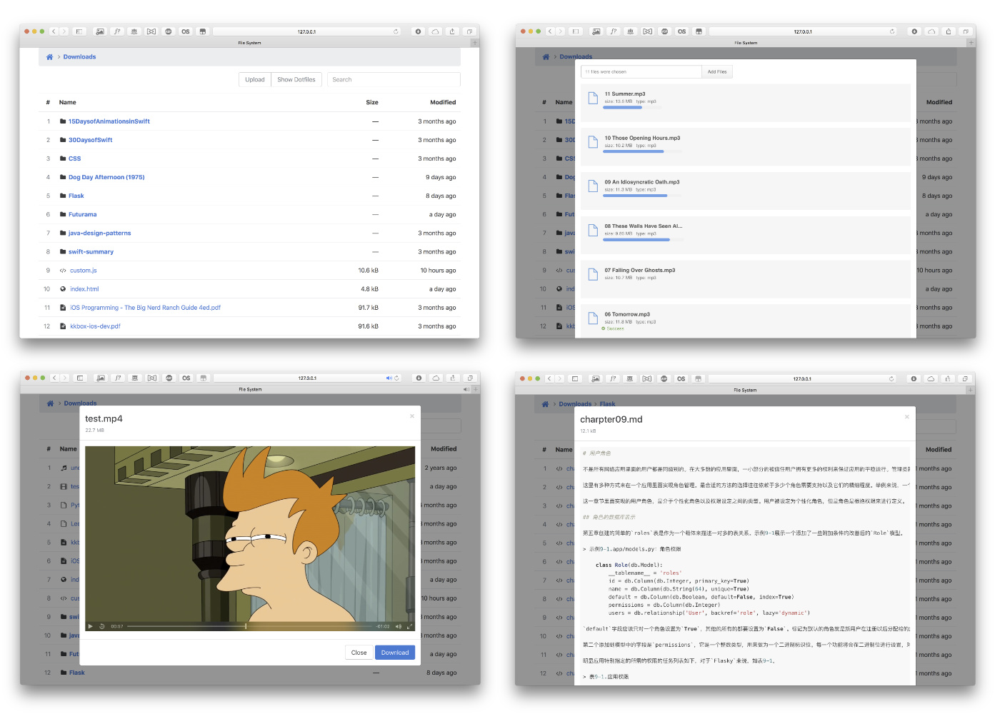

## file-server 文件目录服务器

### 使用方法

```bash
git clone https://github.com/zhudaoruyi/file-server.git
cd file-server
pip install -r requirements.txt
```
然后修改`config.txt`，写入你要连接的路径，如：`E:\project`，然后运行`python file-server.py`

打开浏览器，输入`http://127.0.0.1:8000`可以看到`E:\project`目录下的所有文件


